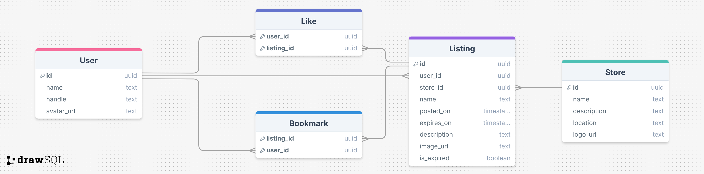

# Design Document

> Written by: Ethan Hernandez, Dinara Aliyeva, Mardon Usmanov, and Kate Song for COMP 426: Modern Web Programming at UNC-Chapel Hill.

## Feature Plan

### Feature 1: Posting Deals

**Description:** Users can create and publish new deals, including a title, description, store, price, expiration date, and image.

**User(s):** All registered users.

**Purpose:** Enables community-driven deal sharing, powered via a crowdsourced effort.

**Technical Notes:** To post a deal, a **publishDeal** function in _web/pages/index.tsx_ (which serves as a HomePage) will be implemented. We will either extend this a pop-up or have a "Write a Deal" feature in the UI (similar to A06 Oriole homepage). From **publishDeal**, we will create a Deal with **createDeal** function in _web/utils/supabase/queries/deal.ts_, which will populate **Listing** table in the database and will be reflected in the UI.

### Feature 2: Bookmark Deals

**Description:** Users can save deals to a personal favorites list for easy access later.

**User(s):** All registered users.

**Purpose:** Improves user experience by allowing users to keep track of deals that interest and are relevant to them.

**Technical Notes:** To add a Deal bookmark, a **toggleBookmark** function in _web/utils/supabase/queries/deal.ts_ will be implemented, which will add/remove a Deal bookmark on toggle/untoggle manipulation in the UI.

### Feature 3: Broadcast Notification on Expiration of Deals

**Description:** System automatically sends notifications to users when deals they've favorited are about to expire/have expired.

**User(s):** Users with favorited deals.

**Purpose:** Ensures users don't miss out on deals because they forgot about their expiration dates.

**Technical Notes:** To broadcast the expiration of deals, **broadcastDealExpiration** function in _web/utils/supabase/realtime/broadcasts.ts_ will be implemented. (This is similar to [Ajay's Coffee Shop broadcast feature](https://github.com/comp426-25s/ajays-coffee-shop/blob/main/web/utils/supabase/realtime/broadcast.ts)).

### Feature 4: Search/Sort Deals

**Description:** Search functionality allowing users to find deals by keywords, or sort by post date, expiration date, or rating.

**User(s):** All visitors to the site.

**Purpose:** Enables any visitor to the site to find deals quickly and easily.

**Technical Notes:** There will be a search bar somewhere on the screen which will take in user-inputted keywords, and display deals that match the user’s input. On the list of displayed deals, there will also be a button to toggle the way in which the deals are sorted. The values of this button will trigger a refetching of the deal data, this time changing the ordering/grouping used in the Supabase query.

### Feature 5: Like Deals

**Description:** Users can like deals to provide feedback.

**User(s):** All registered users.

**Purpose:** Allows users to express their appreciation for deals, which can help its visibility via sorting.

**Technical Notes:** Works similar to the bookmarking feature, except the number of likes a deal has will also be displayed beside the heart icon, and when a user ‘likes’ a deal, the number will increase. Functionality for this will be similar to the liking feature in A06.

## Backend Database Schema

**Description:**

- `user` to `listing` is a one-to-many relationship, because each user can create multiple listings, but each listing can only have one created user.
- Users can bookmark many listings, and each listing can be bookmarked by many users, so this is a many-to-many relationship.
  - Uses a join table called `bookmark`
  - Bookmarks are used to keep track of listings that users are interested in
- Users can like many listings, and each listing can be liked by many users, so this is a many-to-many relationship.
  - Uses a join table called `like`
  - Number of likes is used to determine the popularity of a listing
- `store` to `listing` is a one-to-many relationship, because each store can have multiple listings, but each listing can only belong to one store.

## High-Fidelity Prototype

[Deal Dash Figma Prototype](https://www.figma.com/design/WxoXDc8Df1dsaJ2gP0GYUi/Main?node-id=0-1&t=1msI9ViCaEDvtgoi-1)
